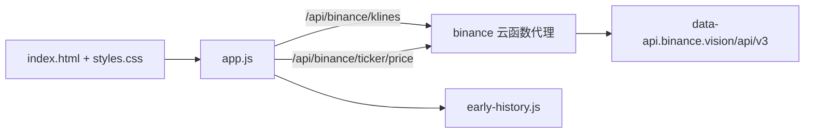

# PROJECT CONTEXT — Crypto Time Machine

> 本文件供任何 AI/Coding Agent 接手本项目时快速建立正确认知。只记录稳定事实与不可轻易推翻的决策。

## 产品定位

- 项目名：**Crypto Time Machine**（仓库/远程名 `AI-Trading-Simulator` 为历史遗留，不反映当前产品）。
- 一句话：**如果我在某个历史日期 ALL IN 买入某币并持有到今天，现在值多少钱。**
- 输入：初始资金（USDT）+ 历史日期（含 `YYYY-MM-DD` 手动输入）+ 币种。
- 输出：买入数量 → 当前理论价值 → 利润 → 收益率。
- 目标：**尽快完成可分享、真实可用的轻量 V1 上线**，不是做交易系统，不扩功能。

## 资产范围（固定，V1 不扩列）

BTC / ETH / DOGE / SOL / SHIB / PEPE / MOODENG / TRUMP，共 8 个，配置于 `app.js` 的 `ASSET_CONFIG`（symbol 为 `XXXUSDT`）。

## 架构

- **前端**：`index.html` + `styles.css` + `app.js`，`"use strict"`，无构建、无依赖、无后端数据库，刷新即重置状态。
- **历史价**：成熟市场走 Binance 日线 K 线（`interval=1d`，取 `candle[4]` 收盘价）；Binance 上市前的早期区间走 `early-history.js` 的“黄金锚点”。
- **当前价**：`/api/binance/ticker/price` 的 `price` 字段。
- **API 代理**：`cloudfunctions/binance/index.js`（CloudBase 云函数签名 `exports.main(event)`，CORS + 路径白名单 + 上游 `data-api.binance.vision`）。
- **脚本加载顺序**：`early-history.js` → `app.js`。

## 部署路线（重要，勿擅自切换）

- **CloudBase（腾讯）是当前实际优先部署路线**：静态托管 + `cloudfunctions/binance` 云函数代理，历史上 V0.3 曾在线成功取到 Binance 行情。
- **`vercel.json` 与 `.github/workflows/pages.yml` 均为 V0.1/V0.2 时代的历史遗留**，与当前“需要 `/api/binance` 接口”的产品不匹配（Vercel 只识别根目录 `api/`，Pages 纯静态）。**除非明确决定迁移，不得擅自切换或改动部署路线。**

## 数据原则（不可轻易推翻）

- 成熟市场统一使用 **Binance 公共行情**作为唯一权威来源。
- **不伪造价格**：`early-history.js` 用于补充 Binance 上市前**已验证**的真实历史价，宁缺毋滥。
- 当前 `early-history.js` **基本为空**：只有 `btc`、`pepe` 两个键且 `prices` 均为空对象，仅结构占位。
- 日期早于 `ASSET_CONFIG.earliestReliableDate` 时，前端直接提示“该资产最早可模拟日期”，不编造。

## 成本与节奏原则

- **节约 AI/Coding Credits**：避免无意义重构、重复测试、不必要的工具迁移。
- 保持**轻量单页**：不引入框架、不引入数据库、不在 V1 增加新功能。

## 不可轻易推翻的项目决策（L）

1. 不伪造任何历史价格；早期数据只允许使用已验证真实锚点。
2. 成熟市场以 Binance 公共行情为唯一来源。
3. 轻量单页、无构建、无依赖、无后端数据库。
4. 8 币范围固定，V1 不扩列。
5. 优先省成本；CloudBase 代理是已工作过的数据路径，不默认迁移 Vercel。

## CURRENT OPEN QUESTIONS

- **CloudBase 当前线上状态**：仓库无 env/域名配置，当前是否仍在线、如何重新部署未确认。
- **8 币 Binance 覆盖**：`earliestReliableDate` 早于 Binance 实际 kline 起始日（BTC/ETH 应为 2017-08-17 起），DOGE/SHIB/SOL 等存在覆盖缺口，早期日期会失败。
- **MOODENG / TRUMP 数据源**：config 自标“待定向市场验证”，`MOODENGUSDT`/`TRUMPUSDT` 是否在 Binance 现货未验证。
- **today 日期 bug**：`validateDateString` 会把“今天”误判为未来日期（`selectedEndOfDay(+1天) > now`）。
- **early-history 缺口**：BTC 的 golden 分支为死代码；PEPE 2023-04-14 ~ 05-04 因 `prices` 为空必失败。
